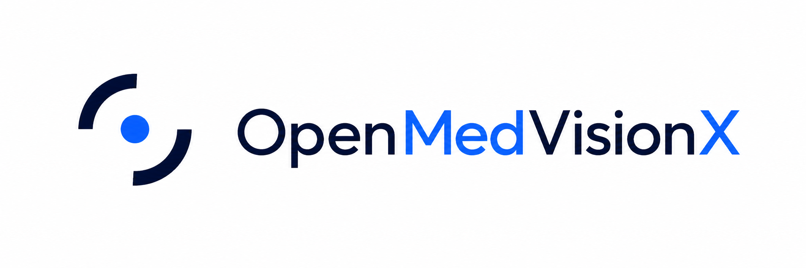

<h1 align="center">OpenMedVisionX</h1>

<p align="center">
  
</p>

<p align="center">
  Learn medical imaging, reconstruction, model inference, and evaluation in one local-first desktop workbench.
</p>

<p align="center">
  <a href="docs/README.zh-CN.md">简体中文</a>
</p>

<p align="center">
  <a href="https://www.python.org/downloads/"></a>
  <a href="https://pypi.org/project/PyQt5/"></a>
  <a href="LICENSE"></a>
</p>

OpenMedVisionX is designed for people learning or exploring medical computer
vision. It keeps image meaning, geometry, preprocessing, intermediate results,
metrics, provenance, and privacy choices visible so that you can understand a
workflow—not merely press a prediction button.

> [!WARNING]
> OpenMedVisionX is for learning and research only. It is not a medical device
> and must not be used for diagnosis, treatment, triage, or patient decisions.

## Why use OpenMedVisionX?

The application is organized into six workspaces. There is no required order,
but the **Learn** workspace provides a safe first experiment.

| Workspace | What you can learn and do |
| --- | --- |
| **Images** | Open raster, DICOM, Enhanced multi-frame CT/MR, and optional NIfTI data; inspect planes, values, geometry, measurements, and layers. |
| **CT Lab** | Generate a synthetic attenuation phantom and compare projection data, FBP, BP, direct Fourier reconstruction, SART, errors, and intermediate states. |
| **Models** | Run three reviewed offline workflows or a compatible user-supplied local model while keeping its input/output contract visible. |
| **Learn** | Follow guided lessons on pixels, medical geometry, reconstruction, model inputs, evaluation, and responsible AI use. |
| **Evaluate** | Check group-safe dataset splits, evaluate binary probabilities at an explicit threshold, inspect calibration, and export a pixel-free experiment record. |
| **AI Assistant** | Ask a configured provider for teaching explanations. The separate **Structured artifacts · API preview** only reviews typed artifacts supplied by a trusted integration; ordinary chat does not populate it. |

The interface switches between English and Simplified Chinese without changing
loaded data or current workspace state. Local viewing, CT experiments,
evaluation, and bundled-model runs do not require a network connection.

## Start in 5 minutes

You need Git, Conda (Miniconda, Anaconda, or Miniforge), and a graphical
desktop. The project environment supplies the supported **Python 3.11**.

```bash
git clone https://github.com/CanyonChen/Open-Med-VisionX.git
cd Open-Med-VisionX
conda env create -f environment.yml
conda activate openmedvisionx
openmedvisionx
```

On later launches, open a terminal in the project directory and run only:

```bash
conda activate openmedvisionx
openmedvisionx
```

For a first success with no file, model, network, or patient data:

1. Open **Learn** and choose **Start first experiment**.
2. The application opens **CT Lab** and runs the deterministic synthetic
   phantom workflow.
3. Compare the input, sinogram, reconstruction, absolute error, and metrics.

The minimum window is **900 × 620 logical pixels**. At 150% operating-system
scaling this is about **1350 × 930 physical pixels**. A complete fit is not
promised on a 1024 × 680 physical-pixel display at 150%; maximize the window,
use a larger display, or lower the scaling level if controls are clipped.

Continue with the step-by-step [Quickstart](docs/QUICKSTART.md).

## Choose your route

| Your goal | Recommended path |
| --- | --- |
| Install and complete a first session | [Documentation home](docs/INDEX.md) → [Quickstart](docs/QUICKSTART.md) |
| Open your own image or volume | [Data and formats](docs/DATA_FORMATS.md) → [User guide](docs/USER_GUIDE.md) |
| Understand every workspace | [User guide](docs/USER_GUIDE.md) |
| Run the reviewed offline models | [Bundled model guide](docs/MODEL_BUNDLES.md) |
| Use another local model | [Custom model guide](docs/CUSTOM_MODELS.md) |
| Learn the underlying concepts | [Learning curriculum](docs/TEACHING_CURRICULUM.md) → [Glossary](docs/GLOSSARY.md) |
| Enable an AI provider safely | [AI Assistant, privacy, and cloud images](docs/LLM_SECURITY.md) |
| Fix an error | [Troubleshooting](docs/TROUBLESHOOTING.md) |

## Supported data and optional features

The base environment opens PNG, JPEG, TIFF, DICOM files/folders/ZIP archives,
supported DICOM SEG and RTSTRUCT objects, and lossless raster label maps.
Optional features are installed only when you need them:

```bash
conda activate openmedvisionx
python -m pip install -e ".[nifti]"          # NIfTI .nii / .nii.gz
python -m pip install -e ".[onnx]"           # user-supplied ONNX models
python -m pip install -e ".[llm]"            # OS keyring integration
```

PyTorch is installed separately because its build must match your CPU, GPU,
operating system, and driver. Follow the [bundled model
guide](docs/MODEL_BUNDLES.md) instead of guessing a CUDA package.

OpenMedVisionX does not infer missing medical meaning. A raster image has no HU
or physical spacing unless a trusted source supplies it; TIFF pages are not
automatically a volume; 4-D NIfTI requires an explicit volume selection; model
inputs are accepted only when they satisfy the declared task contract. See the
complete [support matrix](docs/DATA_FORMATS.md).

## Privacy, scientific boundaries, and license

- OpenMedVisionX reads only paths you select. It does not automatically scan
  neighboring folders, download a dataset, or upload an image.
- Network activity occurs only after you explicitly enable and use an AI
  provider or choose an external link. Sending an image requires an additional
  exact-preview, one-request authorization.
- Source pixels remain unchanged. Display mappings, overlays, and confirmed
  derived resampling previews are recorded separately.
- Three reviewed offline model bundles and one public LoDoPaB-CT teaching case
  are included; no training dataset, BraTS case, API credential, or patient
  image is included.
- OpenMedVisionX is alpha software. Keep backups and independently validate all
  outputs.

The application source is available under the [MIT License](LICENSE). Imported
data, models, adapters, and weights retain their own terms. Report suspected
vulnerabilities or disclosures through the [Security Policy](SECURITY.md).

## Documentation

Start at the bilingual [documentation home](docs/INDEX.md). The main guides are:

- [Quickstart](docs/QUICKSTART.md) · [快速开始](docs/QUICKSTART.zh-CN.md)
- [User guide](docs/USER_GUIDE.md) · [用户指南](docs/USER_GUIDE.zh-CN.md)
- [Bundled model guide](docs/MODEL_BUNDLES.md) · [随包模型指南](docs/MODEL_BUNDLES.zh-CN.md)
- [Learning curriculum](docs/TEACHING_CURRICULUM.md) · [学习课程](docs/TEACHING_CURRICULUM.zh-CN.md)
- [AI Assistant and privacy](docs/LLM_SECURITY.md) · [AI 助手与隐私](docs/LLM_SECURITY.zh-CN.md)
- [Troubleshooting](docs/TROUBLESHOOTING.md) · [故障排查](docs/TROUBLESHOOTING.zh-CN.md)

Every user guide has an English and Simplified Chinese version and links back
to the documentation home.
